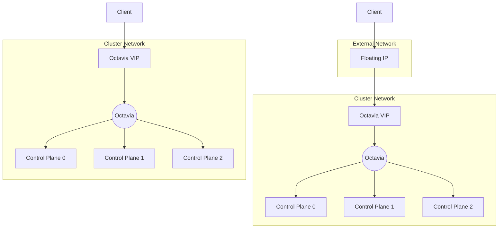
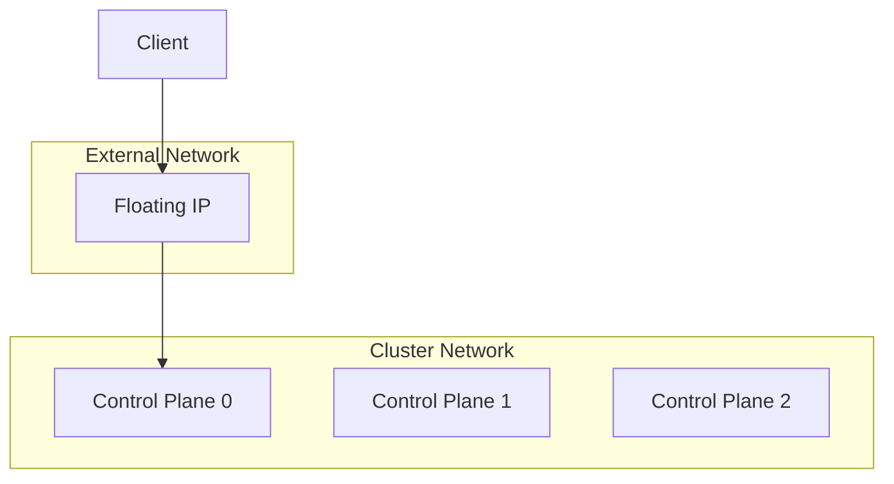

<!-- START doctoc generated TOC please keep comment here to allow auto update -->
<!-- DON'T EDIT THIS SECTION, INSTEAD RE-RUN doctoc TO UPDATE -->
**Table of Contents**  *generated with [DocToc](https://github.com/thlorenz/doctoc)*

- [Exposing the control plane endpoint](#exposing-the-control-plane-endpoint)
  - [Octavia](#octavia)
    - [Parameters](#parameters)
    - [Default behaviour](#default-behaviour)
    - [No floating IP](#no-floating-ip)
    - [Using a pre-created floating IP](#using-a-pre-created-floating-ip)
    - [Deletion of the floating IP](#deletion-of-the-floating-ip)
    - [Exposing additional control plane services running on other ports](#exposing-additional-control-plane-services-running-on-other-ports)
    - [Restricting access to the loadbalancer endpoint](#restricting-access-to-the-loadbalancer-endpoint)
    - [Specifying an alternate primary API server port](#specifying-an-alternate-primary-api-server-port)
    - [Alternate Octavia provider (e.g. OVN)](#alternate-octavia-provider-eg-ovn)
    - [Bugs](#bugs)
- [Floating IP](#floating-ip)
  - [Parameters](#parameters-1)
  - [Default behaviour](#default-behaviour-1)
    - [Using a pre-created floating IP](#using-a-pre-created-floating-ip-1)
- [No loadbalancer](#no-loadbalancer)

<!-- END doctoc generated TOC please keep comment here to allow auto update -->

# Exposing the control plane endpoint

Cluster API requires infrastructure providers like CAPO to expose a control plane endpoint in the `controlPlaneEndpoint` field of the infrastructure cluster spec. This is the endpoint clients, including the management cluster, will use to connect to the kubernetes API server. It is typically loadbalanced across all control plane machines.

CAPO supports 3 different ways of exposing the control plane endpoint:
- Octavia
- Floating IP
- No loadbalancer

If not set in advance, `controlPlaneEndpoint` will be set automatically by the OpenStack cluster controller according to the configuration. It may also be set by the user, in which case it will be used as configuration for the configured endpoint.

This document describes the function of each control plane endpoint type, and the parameters in the `OpenStackCluster` spec which affect their behaviour.

## Octavia

The control plane endpoint can be managed by an Octavia loadbalancer. The loadbalancer's VIP is created on the cluster network, and can optionally be attached to a floating IP. All control plane machines will be added as members of the loadbalancer.

### Parameters

To enable the Octavia loadbalancer, `apiServerLoadBalancer.enabled` must be `true`.

The following parameters are also used by the Octavia loadbalancer.

- controlPlaneEndpoint
- apiServerLoadBalancer
  - enabled
  - additionalPorts
  - allowedCIDRs
  - provider
- disableAPIServerFloatingIP
- apiServerFloatingIP
- apiServerFixedIP
- apiServerPort

### Default behaviour

An Octavia loadbalancer will be created. VIP will be allocated automatically from the default cluster subnet.

`controlPlaneEndpoint.port` will be set to `6443`.

A floating IP will be allocated from the cluster's external network and attached to the Octavia VIP. `controlPlaneEndpoint.host` will be set to the floating IP.

### No floating IP

If your clients can route to the cluster network there is no need for a floating IP as clients can connect directly to Octavia's VIP. To enable this, set `disableAPIServerFloatingIP` to `true`.

If required, you can choose a specific IP for the VIP either by setting it in `apiServerFixedIP` or by setting `controlPlaneEndpoint.host` directly. In this case, the specified IP must be a valid IP in the default cluster subnet.

### Using a pre-created floating IP

To use a specific floating IP it must be created in advance. This is because creating a floating IP with a specific IP requires OpenStack admin privileges. It is not recommended to give CAPO OpenStack admin privileges.

The pre-created floating IP must be specified either in `apiServerFloatingIP` or in `controlPlaneEndpoint.host`. Note that if it is not specified in `apiServerFloatingIP` it will be deleted when the cluster is deleted.

### Deletion of the floating IP

When using Octavia, the loadbalancer's floating IP will be deleted when the cluster is deleted unless it is specified in `apiServerFloatingIP`.

If you need to keep a floating IP which was created automatically with the cluster, it is possible to set `apiServerFloatingIP` to the current floating IP after the cluster has been created.

### Exposing additional control plane services running on other ports

If the control plane machines are hosting services other than the kubernetes API server, these may also be exposed via the API server loadbalancer by specifying their ports in `apiServerLoadBalancer.additionalPorts`. If using managed security groups, these ports will be automatically added to the control plane security group.

### Restricting access to the loadbalancer endpoint

It is possible to restrict access to the control plane endpoint to certain source address ranges by specifying them in `apiServerLoadBalancer.allowedCIDRs`. When setting this list, the following additional CIDRs will be automatically added to the allowed list:
- the Bastion's floating and internal IPs
- all subnets of the default cluster network
- the cluster router's IPs

> ***Warning***
>
> This parameter will be ignored if Octavia does not support allowed CIDRs. Access will be permitted from any source.

### Specifying an alternate primary API server port

To specify a different port for the control plane endpoint, set either `apiServerPort`, or `controlPlaneEndpoint.port` if also specifying `controlPlaneEndpoint.host`.

### Alternate Octavia provider (e.g. OVN)

To use a provider other than Octavia's default provider, specify its name in `apiServerLoadBalancer.provider`. For OVN this should be set to `ovn`.

> ***Warning***
>
> This parameter will be ignored if Octavia does not support the specified provider. Octavia will use the default provider instead.

### Bugs

While Cluster API specifies that `controlPlaneEndpoint.host` may be either a hostname or an IP address, there are still several uses of it in CAPO which assume it is an IP address and will break if it is not.

# Floating IP

The control plane endpoint can be provided by a floating IP connected directly to one of the control plane machines.

> ***Warning***
>
> This configuration is not recommended, except for test clusters which will not be upgraded. In addition to not providing any load balancing or failover, there are known bugs in its implementation which will cause loss of control plane access after an upgrade.

## Parameters

To enable the floating IP control plane endpoint, the following 2 parameters must be false or unset:
- `apiServerLoadBalancer.enabled`
- `disableAPIServerFloatingIP`

The following parameters are also used by the floating IP control plane endpoint:

- controlPlaneEndpoint
- apiServerFloatingIP
- apiServerPort

## Default behaviour

A floating IP will be created on the cluster's external network. It will be attached to the first control plane machine to be created.

### Using a pre-created floating IP

To use a specific floating IP it must be created in advance. This is because creating a floating IP with a specific IP requires OpenStack admin privileges. It is not recommended to give CAPO OpenStack admin privileges.

The pre-created floating IP must be specified either in `apiServerFloatingIP` or in `controlPlaneEndpoint.host`.

> ***Warning***
>
> Note that if the floating IP is not specified in `apiServerFloatingIP` it will be deleted when the control plane machine it is currently attached to is deleted, for example during an upgrade. It is not possible to recover from this automatically.

# No loadbalancer

CAPO can be configured not to configure a control plane endpoint by setting:
- `apiServerLoadBalancer.enabled` to false or unset
- `disableAPIServerFloatingIP` to true

In this case it is the user's responsibility to ensure that clients are able to access the control plane.

Note that CAPI still requires us to publish a control plane endpoint in `controlPlaneEndpoint`, so you must set this explicitly.