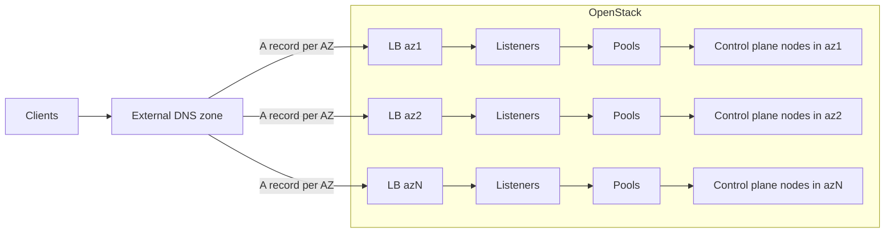

# Multi-AZ API Server LoadBalancer for CAPO

## Summary
Add first-class Multi-AZ support for the Kubernetes control plane LoadBalancer in Cluster API Provider OpenStack (CAPO). The feature reconciles one Octavia LoadBalancer per Availability Zone (AZ), places each VIP in the intended subnet for that AZ via an explicit AZ→Subnet mapping, and by default registers control plane nodes only with the LB in the same AZ. Operators expose the control plane endpoint via external DNS multi-value A records that point at the per-AZ LB IPs. This proposal is additive and backward compatible.

## Motivation
- Achieve true multi-AZ resilience for the control plane by avoiding a single VIP dependency.
- Align control plane networking with existing multi-AZ compute placement goals.
- Provide clear, portable primitives across Octavia providers with native AZ hints and an explicit, unambiguous mapping between AZs and VIP subnets.

## Goals
- Create and manage one API server LoadBalancer per configured AZ.
- Support explicit AZ→Subnet mapping only (no positional mapping).
- Default to same-AZ LB membership for control plane nodes; allow opt-in cross-AZ registration.
- Keep the API additive with strong validation, clear events and documentation.
- Preserve user-provided DNS endpoints; DNS record management remains out of scope.

## Non-Goals
- Managing or provisioning DNS records.
- Provider-specific topologies such as ACTIVE_STANDBY across fault domains.
- Service type LoadBalancer for worker Services.
- Automatic creation of the network and subnets; the operator is responsible for creating the network and subnets before enabling multi-AZ LoadBalancer.

## User Stories
1) As a platform engineer, I want per-AZ LBs so a full AZ outage leaves the cluster reachable via DNS multi-A records that resolve to the remaining AZs.
2) As an operator, I want a safe migration path from single-LB clusters to per-AZ LBs without downtime.
3) As an operator, I pre-create the network and subnets for each AZ and then configure CAPO to place a LoadBalancer in each one.

## Design Overview

### High-level behavior
- When enabled and configured with an explicit mapping, CAPO reconciles one LoadBalancer per Availability Zone (AZ).
- VIP placement is controlled only by an explicit mapping list that binds each AZ to a specific subnet on the LB network.
- Each per-AZ LB is named with an AZ suffix.
- Control plane nodes are registered as LB members only in their AZ by default; opt-in cross-AZ membership is supported.
- Operators expose an external DNS name for the control plane endpoint with one A/AAAA record per AZ LB IP.

### Architecture diagram


## API Changes (additive)

All changes are confined to the OpenStackCluster API and are backward compatible. Proposed changes in:
- [api/v1beta1/openstackcluster_types.go](../../api/v1beta1/openstackcluster_types.go)
- [api/v1beta1/types.go](../../api/v1beta1/types.go)

### Spec additions on `APIServerLoadBalancer`
- `availabilityZoneSubnets []AZSubnetMapping` (required to enable multi-AZ)
  - Explicit mapping; each entry includes:
    - `availabilityZone string`
    - `subnet SubnetParam`
  - The LB network MUST be specified when using this mapping via `spec.apiServerLoadBalancer.network`. Each mapped subnet MUST belong to that network.
- `allowCrossAZLoadBalancerMembers *bool`
  - Default `false`.
  - When `true`, register control plane nodes to all per-AZ LBs; otherwise same-AZ only.
- `additionalPorts []int`
  - Optional extra listener ports besides the Kubernetes API port.
- `allowedCIDRs []string`
  - Optional VIP ACL list when supported by the Octavia provider.

Notes:
- The existing single-value `availabilityZone` field (if present) is treated as a legacy single-AZ shorthand; multi-AZ requires `availabilityZoneSubnets`.

### Status additions
- `apiServerLoadBalancers []LoadBalancer`
  - A list-map keyed by `availabilityZone` (kubebuilder `listMapKey=availabilityZone`).
  - Each entry includes: `name`, `id`, `ip`, `internalIP`, `tags`, `availabilityZone`, `loadBalancerNetwork`, `allowedCIDRs`.

### Validation (CRD and controller)
- No duplicate `availabilityZone` values in `availabilityZoneSubnets`.
- Each `availabilityZoneSubnets.subnet` MUST resolve to a subnet that belongs to the specified LB network.
- No duplicate subnets across mappings.
- At least one mapping is required to enable multi-AZ; otherwise behavior is legacy single-LB.

CRD updates in:
- [config/crd/bases/](../../config/crd/bases/)
- [config/crd/patches/](../../config/crd/patches/)

## Controller Design

Changes span these components:
- [controllers/openstackcluster_controller.go](../../controllers/openstackcluster_controller.go)
- [pkg/cloud/services/loadbalancer/](../../pkg/cloud/services/loadbalancer/)
- [pkg/cloud/services/networking/](../../pkg/cloud/services/networking/)

### VIP network and subnet resolution
- When `spec.apiServerLoadBalancer.network` is specified with `availabilityZoneSubnets`:
  - Resolve each `SubnetParam` in order; validate that each belongs to the given LB network.
  - Derive the AZ list directly from the mapping entries.
  - Persist the LB network and the ordered subnets into `status.apiServerLoadBalancer.loadBalancerNetwork`.
- Legacy single-AZ behavior (no mapping provided):
  - If an LB network is specified but no mapping is provided, treat as single-LB and select a subnet per legacy rules (unchanged).
  - If no LB network is specified, default to the cluster network's subnets (unchanged single-LB behavior).

Initialize or update `status.apiServerLoadBalancers` entries to carry the LB network reference.

### Per-AZ LoadBalancer reconciliation
For each AZ in `availabilityZoneSubnets`:
- Determine the VIP subnet from the mapping and create or adopt a LoadBalancer named:
  - k8s-clusterapi-cluster-${NAMESPACE}-${CLUSTER_NAME}-${AZ}-kubeapi
- Set Octavia `AvailabilityZone` hint when supported by the provider.
- Create or adopt listeners, pools, and monitors for the API port and any `additionalPorts`.
- If floating IPs are not disabled, allocate and associate a floating IP to the LB VIP port when needed.
- Update or insert the AZ entry in `status.apiServerLoadBalancers`, including `name`, `id`, `internalIP`, optional `ip`, `tags`, `allowedCIDRs`, and `loadBalancerNetwork`.

### Legacy adoption and migration
- Discover legacy single-LB resources named:
  - `k8s-clusterapi-cluster-${NAMESPACE}-${CLUSTER_NAME}-kubeapi`
- When multi-AZ is enabled (`availabilityZoneSubnets` provided), rename legacy resources to the AZ-specific name for the first configured AZ, or adopt correctly named resources if they already exist.
- Emit clear events and warnings; ensure idempotent operation.

### Member registration behavior
- Determine the machine failure domain (AZ) from the owning control plane machine.
- Default behavior: register the node only with the LoadBalancer whose `availabilityZone` matches the node's AZ; if the legacy LB exists without an AZ, include it as a fallback.
- When `allowCrossAZLoadBalancerMembers` is `true`: register the node with all per-AZ LBs.
- Reconcile membership across the API port and any `additionalPorts`.

### Control plane endpoint
- Preserve a user-provided DNS in `spec.controlPlaneEndpoint` when set and valid.
- Otherwise choose:
  - The LB floating IP if present, else the VIP for an LB.
  - If no LB host is available and floating IPs are allowed, allocate or adopt a floating IP for the cluster endpoint when applicable.
  - If floating IPs are disabled and a fixed IP is provided, use it.
- Operators are expected to configure DNS with one A/AAAA record per AZ LB IP for client-side failover. CAPO does not manage DNS.

### Events and metrics
- Emit events for create/update/delete of LBs, listeners, pools, monitors, and floating IPs.
- Emit warnings when provider features are unavailable or when validations fail.
- Optional metrics (non-breaking) for per-AZ LB counts and reconciliation latency.

## Example configurations

### Explicit AZ→Subnet mapping (required for multi-AZ)
```yaml
apiVersion: infrastructure.cluster.x-k8s.io/v1beta1
kind: OpenStackCluster
metadata:
  name: my-cluster
  namespace: default
spec:
  apiServerLoadBalancer:
    enabled: true
    network:
      id: 6c90b532-7ba0-418a-a276-5ae55060b5b0
    availabilityZoneSubnets:
      - availabilityZone: az1
        subnet:
          id: cad5a91a-36de-4388-823b-b0cc82cadfdc
      - availabilityZone: az2
        subnet:
          id: e2407c18-c4e7-4d3d-befa-8eec5d8756f2
    allowCrossAZLoadBalancerMembers: false
```

### Allow cross-AZ member registration
```yaml
spec:
  apiServerLoadBalancer:
    enabled: true
    network:
      id: 6c90b532-7ba0-418a-a276-5ae55060b5b0
    availabilityZoneSubnets:
      - availabilityZone: az1
        subnet:
          id: cad5a91a-36de-4388-823b-b0cc82cadfdc
      - availabilityZone: az2
        subnet:
          id: e2407c18-c4e7-4d3d-befa-8eec5d8756f2
    allowCrossAZLoadBalancerMembers: true
```

## Backward compatibility and migration

- Default behavior remains single-LB when no multi-AZ mapping is provided.
- Enabling multi-AZ:
  - Operators add `availabilityZoneSubnets` (and optionally `additionalPorts`, `allowedCIDRs`, `allowCrossAZLoadBalancerMembers`) and must specify the LB network.
  - Controller renames or adopts legacy resources into AZ-specific naming.
  - `status.apiServerLoadBalancers` is populated alongside legacy status until further cleanup.
- Disabling multi-AZ:
  - Operators redirect all traffic to a single LB (e.g. update DNS records) and then remove the AZ mapping from the spec.
  - The controller automatically deletes per-AZ LBs whose mappings have been removed and reverts to single-LB behavior.

## Testing strategy

### Unit tests
- Validation: duplicate AZs, duplicate subnets in mapping, wrong network-subnet associations.
- LB reconciliation: AZ hint propagation, per-port resource creation and updates.
- Migration/adoption: renaming legacy resources and adopting correctly-named resources.
- Member registration: defaults and cross-AZ opt-in.
- Allowed CIDRs: canonicalization and provider capability handling.

### E2E tests
- Multi-AZ suite to verify per-AZ LBs exist with expected names and ports.
- `status.apiServerLoadBalancers` contains per-AZ entries including LB network and IPs.
- Control plane nodes register to same-AZ LB (or to all LBs when cross-AZ is enabled).
- DNS records remain out of scope for e2e.

Test code locations:
- [pkg/cloud/services/loadbalancer/](../../pkg/cloud/services/loadbalancer/)
- [controllers/](../../controllers/)
- [test/e2e/](../../test/e2e/)

## Risks and mitigations
- Mapping/network mismatches: reject with clear validation messages; enforce via CRD CEL where feasible and in-controller checks.
- Providers ignoring AZ hints: VIP subnet mapping still ensures deterministic placement; document expected variance.
- Increased resource usage: multiple LBs per cluster increase quota consumption; highlight in docs and operations guidance.
- DNS misconfiguration: documented as operator responsibility.

## Rollout plan
1) API and CRD changes:
   - Add new fields and list-map keyed status to OpenStackCluster types in [api/v1beta1/](../../api/v1beta1/).
   - Update CRDs in [config/crd/bases/](../../config/crd/bases/) and patches in [config/crd/patches/](../../config/crd/patches/).
2) Controller implementation:
   - VIP network/subnet resolution and explicit AZ mapping in [controllers/openstackcluster_controller.go](../../controllers/openstackcluster_controller.go).
   - Per-AZ LB reconciliation, rename/adoption, member selection, and optional floating IPs in [pkg/cloud/services/loadbalancer/](../../pkg/cloud/services/loadbalancer/).
3) Documentation:
   - Update configuration guide and examples in [docs/book/src/clusteropenstack/configuration.md](../book/src/clusteropenstack/configuration.md).
4) Testing:
   - Unit tests across controller and services; e2e suite updates in [test/e2e/](../../test/e2e/).
5) Optional metrics:
   - Add observability for per-AZ LB counts and reconciliation timings (non-breaking).

## Open questions
- Should we add a future explicit field to declare the endpoint strategy (single VIP vs external DNS multi-A)? Current design preserves user-provided DNS and documents multi-A.